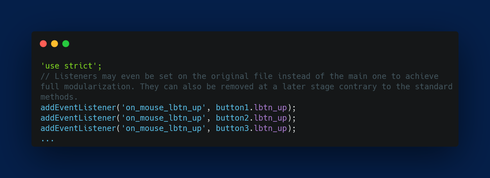
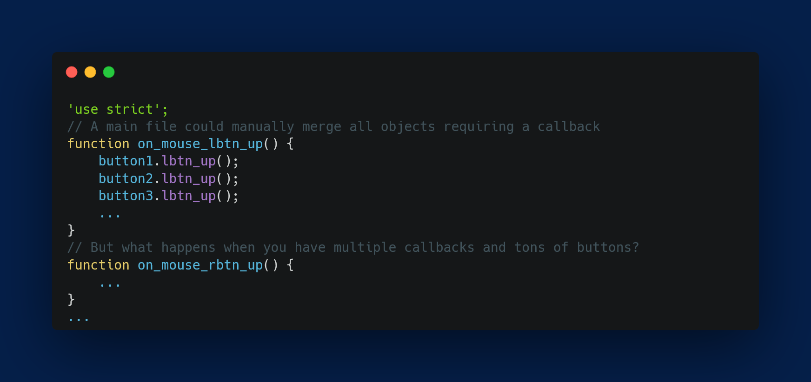

# Callbacks Framework

[Download :material-download:](https://github.com/regorxxx/Callbacks-Framework-SMP){ .md-button }

## Overview

A helper script for [Spider Monkey Panel](https://theqwertiest.github.io/foo_spider_monkey_panel)
 and [foobar2000](https://www.foobar2000.org) which allows to easily attach and manage event
 listeners associated to SMP callbacks without wrapping or repeating code.  A lifesaver. 

 
### Features
- Adds event listeners to SMP callbacks.
- Removes event listeners on demand.
- Allows to find if an event listener is active.
- Listeners are able to self-remove.
- Mimics [mozilla implementation](https://developer.mozilla.org/es/docs/Web/API/EventTarget/removeEventListener).
- Implements [SPM planned design](https://github.com/TheQwertiest/foo_spider_monkey_panel/projects/1).
- Bypasses common limitation of including files with existing callbacks, wrapping, etc.

!!! info
	See repository for usage details.