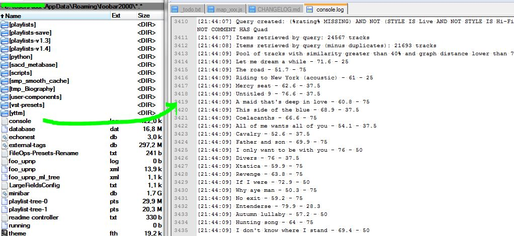
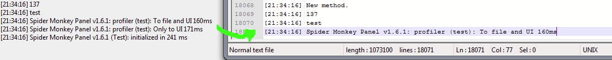

# Console

[Download :material-download:](https://github.com/regorxxx/Console-SMP){ .md-button }

## Overview

A helper script for [Spider Monkey Panel](https://theqwertiest.github.io/foo_spider_monkey_panel)
 and [foobar2000](https://www.foobar2000.org) which allows to permanently save console logs
 to a file using the existing method (console.log).

### Features
- Saves any message sent to the console on a text file (path configurable).
- Saving is not reset on every start-up (contrary to Foobar2000's native console).  
- File is only reset when certain file size is reached (configurable).
- Works 'as is' without any modification on existing scripts, just include it and done.
- Converts sets and maps to arrays before logging.
- Converts standard objects and functions to strings before logging.
- Writing frequency to physical file can be adjusted.
- The profiler has also been wrapped

!!! info
	See repository for usage details.