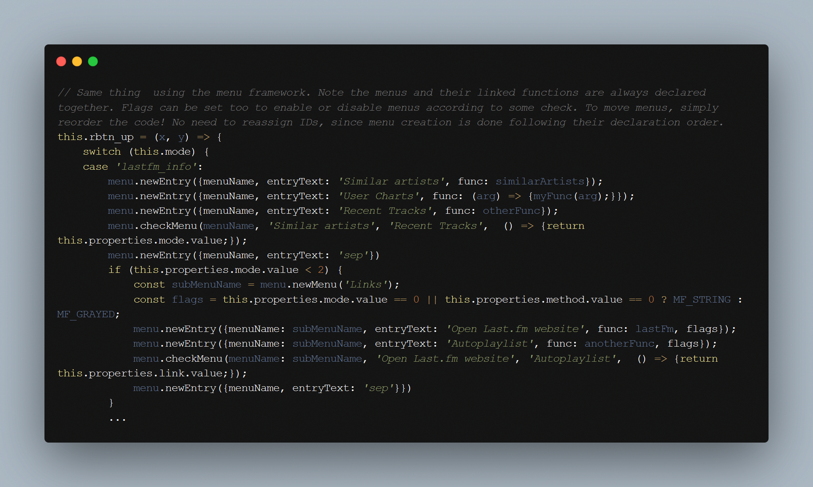
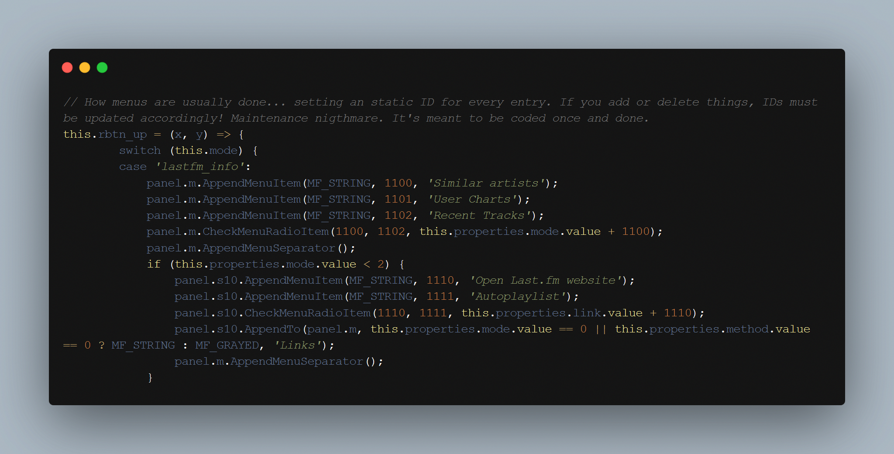
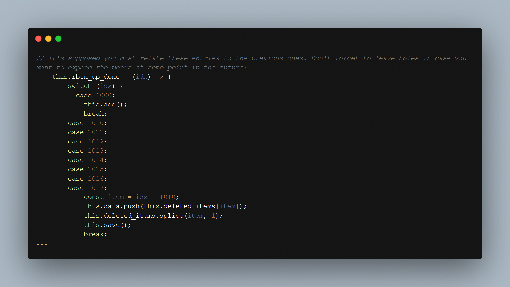

# Menu Framework

[Download :material-download:](https://github.com/regorxxx/Menu-Framework-SMP){ .md-button }

## Overview

A helper script for [Spider Monkey Panel](https://theqwertiest.github.io/foo_spider_monkey_panel)
 and [foobar2000](https://www.foobar2000.org) which allows to easily create customizable menus
 on demand which can be easily refactored, moved or edited without working with static ids. A lifesaver.
 

## The problem with current SMP menus
Menus are usually coded at multiple places which must be linked by ID, storing and sharing
 the different variables for menus and submenus when you have multiple objects using them,
 etc. It leads to 2 clear problems: non readability and maintenance nightmare.
 

 - Creates menus on demand on panels without needing to create specific methods for every script,
 calculate IDs, etc.  
- Menus are pushed to a list and created automatically on demand, linking the entries to their
 idx without needing a 'switch' block or leaving holes to ensure idx get enough numbers to expand the script.  
- The main utility of this helper is greatly reducing coding for simple menus and having both,
 the menu logic creation and the menus' functions on the same place. Creation order is done 
 following entry/menus addition.
- Can concatenate multiple menus on btn_up().

!!! info
	See repository for usage details.