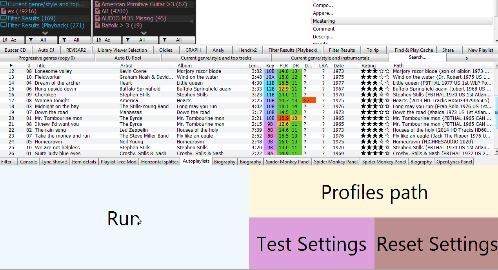
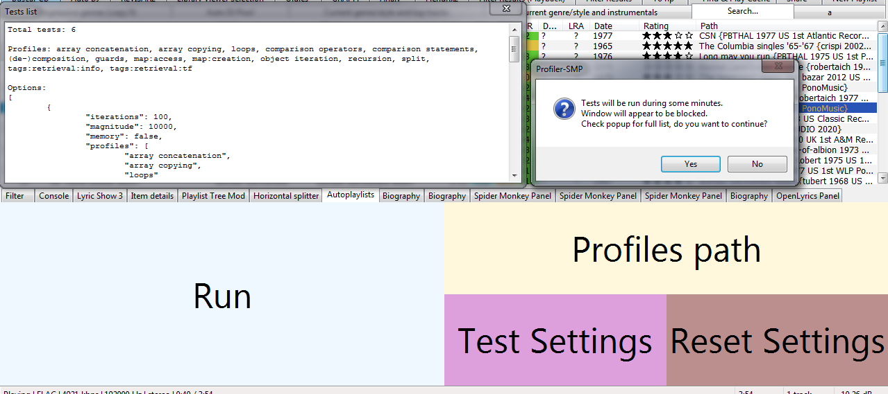

# Profiler

[Download :material-download:](https://github.com/regorxxx/Profiler-SMP){ .md-button }

## Overview

JavaScript [Spider Monkey Panel](https://theqwertiest.github.io/foo_spider_monkey_panel)
 profiling tool and library of profiling modules and benchmarks for [foobar2000](https://www.foobar2000.org).
 Profiler-SMP allows you to compare different techniques, operators and functions regarding
 execution speed and memory consumption. It reports results either in table text or JSON format.
 

### Features
- Report: average, max, minimum and total.
  - Execution time.
  - Memory.
 - Built-in tests, easily expandable.
- Output:
  - JSON
  - TXT tables
  - Popups

###  Available tests
- Array concatenation
- Array copying
- Loops
- Comparison operators
- Comparison statements
- (De-)composition
- Guards
- Map:access
- Map:creation
- Object iteration
- Recursion
- Split
- Tags:retrieval:info
- Tags:retrieval:tf

!!! info
	See repository for usage details.