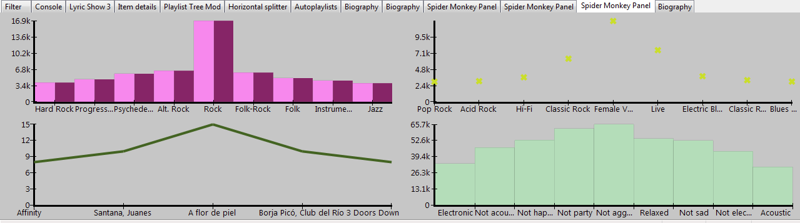
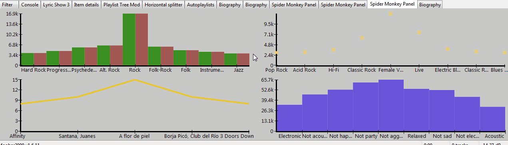
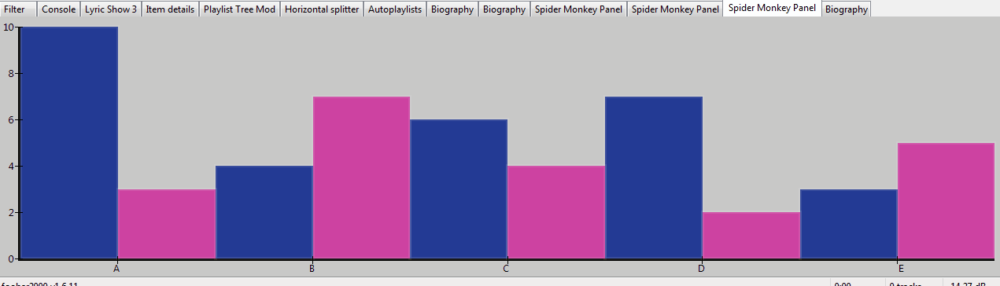

# Statistics Framework

[Download :material-download:](https://github.com/regorxxx/Statistics-Framework-SMP){ .md-button }

## Overview

A helper script for [Spider Monkey Panel](https://theqwertiest.github.io/foo_spider_monkey_panel)
 and [foobar2000](https://www.foobar2000.org) which allows to easily create customizable charts
 on demand, applying basic filtering, sorting and distribution settings.
 

### Features
- Create charts: bars, scatter, line.  
- Colors, axis, background, margins, labels and points are customizable.
- Built-in color palettes using [Chroma](https://gka.github.io/chroma.js/) and [ColorBrewer](https://colorbrewer2.org), also colorblind friendly presets.
- Data may be filtered, sorted or sliced on the fly.
- Data may be fit to a distribution or shown 'as is' (with selected sorting).
- Multiple series can be drawn on the same chart.
- Built-in menus to customize charts.

### Other implementations
 1. [Timeline-SMP](https://github.com/regorxxx/Timeline-SMP): Interactive Timeline of your library. Configurable by Title Format.
 2. [Playlist-Manager-SMP](https://github.com/regorxxx/Playlist-Manager-SMP): A playlist manager for foobar2000.
 3. [World-Map-SMP](https://github.com/regorxxx/World-Map-SMP): Displays current artist's country on the world map. 

!!! info
	See repository for usage details.